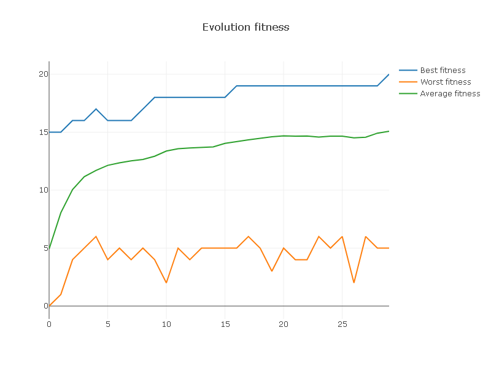

# Keen | Kotlin Evolutionary Computation Framework

[](https://jitpack.io/#r8vnhill/keen)
[](https://opensource.org/licenses/BSD-2-Clause)


Keen is a framework for Kotlin that leverages evolutionary algorithms to solve optimization problems.
It harnesses the power and expressiveness of Kotlin to provide an 
intuitive and efficient interface for researchers, scientists, and 
developers alike.
With Keen, you can build and fine-tune complex evolutionary algorithms 
with just a few lines of code.

Whether you are delving into genetic algorithms for the first time or are
an experienced researcher looking for a Kotlin-native tool, Keen offers a
streamlined experience without sacrificing depth or flexibility. Its 
modular architecture means you can easily extend or modify components, 
from selection and crossover methods to mutation and fitness evaluation.

## Installation

### Gradle Kotlin DSL

```kotlin
repositories {
    maven {
        url = uri("https://jitpack.io")
    }
    /* ... */
}

dependencies {
    implementation("com.github.r8vnhill:keen:2.0-ALPHA-2")
    /* ... */
}
```

## Examples

The following examples only have the explanation of what's the problem to solve.
You can find the explanations of the code in the [wiki](https://github.com/r8vnhill/keen/wiki).

### One Max (Ones Counting) Problem

The _One Max_ problem is a well known problem widely used to exemplify the genetic algorithms'
capabilities. 
The problem consists of maximizing the number of ones in a bit string. 
The following example shows how to solve the _One Max_ problem with _Keen_.

#### Implementation

```kotlin
fun count(genotype: Genotype<Boolean>) = genotype.flatten().count { it }.toDouble()

fun main() {
    val engine = engine(::count, genotype {
        chromosome { booleans { size = 20; truesProbability = 0.15 } }
    }) {
        populationSize = 500
        selector = TournamentSelector(sampleSize = 2)
        alterers = listOf(Mutator(probability = 0.55), SinglePointCrossover(probability = 0.2))
        limits = listOf(GenerationCount(100), TargetFitness(20.0))
        statistics = listOf(StatisticCollector(), StatisticPlotter())
    }
    engine.run()
    println(engine.statistics.first())
    (engine.statistics.last() as StatisticPlotter).displayFitness()
}
```

#### Output

```text
------------ Statistics Collector -------------
-------------- Selection Times ----------------
|--> Offspring Selection
|   |--> Average: 1.5 ms
|   |--> Max: 16 ms
|   |--> Min: 0 ms
|--> Survivor Selection
|   |--> Average: 1.5 ms
|   |--> Max: 16 ms
|   |--> Min: 0 ms
--------------- Alteration Times --------------
|--> Average: 3.5625 ms
|--> Max: 42 ms
|--> Min: 0 ms
-------------- Evolution Results --------------
|--> Total time: 632 ms
|--> Average generation time: 19.375 ms
|--> Max generation time: 190 ms
|--> Min generation time: 3 ms
|--> Generation: 32
|--> Steady generations: 0
|--> Fittest: {  [ 1111|1111|1111|1111|1111 ]  -> 20.0 }
|--> Best fitness: 20.0
```



### Word Guessing Problem

The _Word Guessing_ problem is a problem where the goal is to guess a word of known length by just
being able to ask "how many characters are in the correct position?".

#### Implementation

```kotlin
private fun matches(genotype: Genotype<Char>) = genotype.flatten()
    .filterIndexed { index, char -> char == TARGET[index] }
    .size.toDouble()

fun main() {
    val engine = engine(::matches, genotype {
        chromosome { chars { size = TARGET.length } }
    }) {
        populationSize = 500
        survivorSelector = RouletteWheelSelector()
        alterers = listOf(Mutator(0.03), SinglePointCrossover(0.06))
        limits = listOf(TargetFitness(TARGET.length.toDouble()))
        statistics = listOf(StatisticPrinter(every = 10), StatisticPlotter())
    }
    val evolvedPopulation = engine.run()
    println("Solution found in ${evolvedPopulation.generation} generations")
    println("Solution: ${evolvedPopulation.best?.genotype}")
    println("With fitness: ${evolvedPopulation.best?.fitness}")
    (engine.statistics.last() as StatisticPlotter).displayFitness()
}
```

### Function Optimization Problem

Here we want to find the minimum of the function ``f(x) = ln(cos(sin(it)) + sin(cos(it)))``.

```kotlin
private fun fitnessFunction(genotype: Genotype<Double>) = genotype.flatten().first()
    .let {
        ln(cos(sin(it)) + sin(cos(it)))
    }

fun main() {
    val engine = engine(::fitnessFunction, genotype {
        chromosome { doubles { size = 1; range = (-2.0 * Math.PI) to (2 * Math.PI) } }
    }) {
        populationSize = 500
        optimizer = FitnessMinimizer()
        alterers = listOf(Mutator(0.1), MeanCrossover(0.15))
        limits = listOf(SteadyGenerations(20))
        statistics = listOf(StatisticCollector(), StatisticPlotter())
    }
    engine.run()
    println(engine.statistics.first())
    (engine.statistics.last() as StatisticPlotter).displayFitness()
}
```

## Acknowledgements

This project has benefited from the support provided by JetBrains. We're immensely grateful for their backing.

<div style="text-align: center;">

</div>

A big thank you to [JetBrains](https://jb.gg/OpenSourceSupport) for their open-source support.
