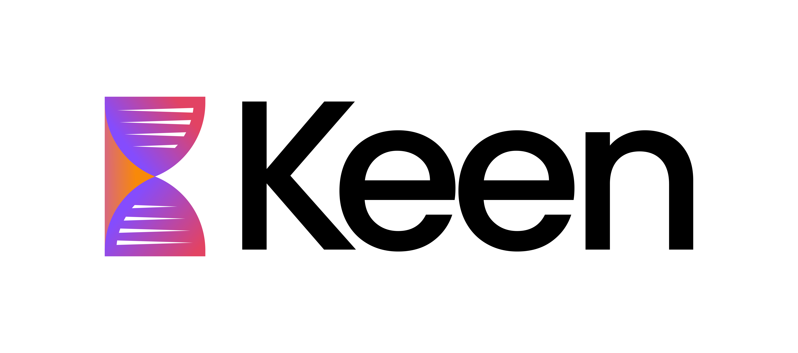
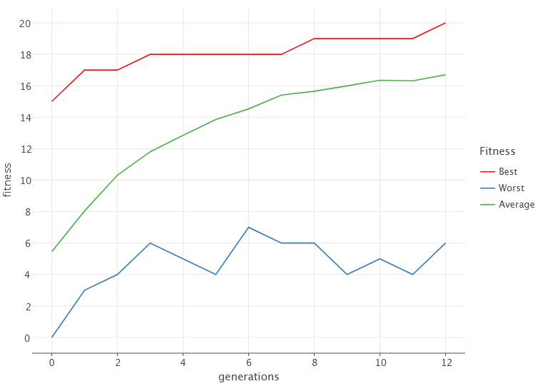

# Keen | Kotlin Evolutionary Computation Framework

[](https://search.maven.org/artifact/cl.ravenhill/keen-core)
[](https://opensource.org/licenses/BSD-2-Clause)



Keen is a framework for Kotlin that leverages evolutionary algorithms to solve optimization problems.
It harnesses the power and expressiveness of Kotlin to provide an intuitive and efficient interface for researchers,
scientists, and developers alike.
With Keen, you can build and fine-tune complex evolutionary algorithms with just a few lines of code.

Whether you are delving into genetic algorithms for the first time or are an experienced researcher looking for a 
Kotlin-native tool, Keen offers a streamlined experience without sacrificing depth or flexibility. Its modular
architecture means you can easily extend or modify components, from selection and crossover methods to mutation and 
fitness evaluation.

## Table of Contents

- [Installation](#installation)
  - [Gradle Kotlin DSL Setup](#gradle-kotlin-dsl-setup)
    - [Step 1: Specify Versions in `gradle.properties`](#step-1-specify-versions-in-gradleproperties)
    - [Step 2: Configure Plugin Management in `settings.gradle.kts`](#step-2-configure-plugin-management-in-settingsgradlekts)
    - [Step 3: Configure Project Plugins, Repositories, and Dependencies](#step-3-configure-project-plugins-repositories-and-dependencies)
  - [Additional Notes](#additional-notes)
- [Examples](#examples)
  - [One Max (Ones Counting) Problem](#one-max-ones-counting-problem)
    - [Implementation](#implementation)
    - [Output](#output)
- [Acknowledgements](#acknowledgements)

## Installation

This section guides you through the process of setting up the Keen framework and the EvolutionPlotter in your Kotlin 
project using Gradle Kotlin DSL.

### Gradle Kotlin DSL Setup

#### Step 1: Specify Versions in `gradle.properties`
First, define the versions of Keen and Compose in your `gradle.properties` file. Make sure to replace these with the 
latest versions available.

```
# gradle.properties
# Keen framework version. Replace with the latest version.
keen.version=1.1.0
# Compose version for the EvolutionPlotter. Replace at your discretion.
compose.version=1.5.11
```

#### Step 2: Configure Plugin Management in `settings.gradle.kts`
This step is essential only if you plan to use the EvolutionPlotter. Here, you configure the plugin management for the
Compose plugin.

```kotlin
// settings.gradle.kts
pluginManagement {
    repositories {
        gradlePluginPortal()  // Standard Gradle plugin repository.
        maven("https://maven.pkg.jetbrains.space/public/p/compose/dev")  // Repository for JetBrains Compose.
        google()  // Google's Maven repository, sometimes needed for dependencies.
    }

    plugins {
        id("org.jetbrains.compose") version extra["compose.version"] as String  // Apply the Compose plugin with the specified version.
    }
}
```

#### Step 3: Configure Project Plugins, Repositories, and Dependencies
In your build script, configure the necessary plugins, repositories, and dependencies.

```kotlin
val keenVersion: String = extra["keen.version"] as String  // Retrieve the Keen version defined earlier.

plugins {
    /* ... */
    id("org.jetbrains.compose") // Include this only if using the EvolutionPlotter.
}

repositories {
    mavenCentral()  // Maven Central repository for most dependencies.
    /* ... */
}

dependencies {
    implementation("cl.ravenhill:keen-core:$keenVersion")  // Keen core library dependency.
    implementation(compose.desktop.currentOs)   // Compose dependency, required for the EvolutionPlotter.
    /* ... */
}
```

### Additional Notes:
- Ensure that the versions specified in `gradle.properties` are compatible with your project setup.
- The `pluginManagement` block in `settings.gradle.kts` is crucial for resolving the Compose plugin, especially if 
  you're using features like the EvolutionPlotter.
- Remember to sync your Gradle project after making changes to these files to apply the configurations.

## Examples

The following examples only have the explanation of what's the problem to solve.
You can find the explanations of the code in the [wiki](https://github.com/r8vnhill/keen/wiki).

### One Max (Ones Counting) Problem

The _One Max_ problem is a well known problem widely used to exemplify the genetic algorithms'
capabilities.
The problem consists of maximizing the number of ones in a bit string.
The following example shows how to solve the _One Max_ problem with _Keen_.

#### Implementation

```kotlin
import cl.ravenhill.keen.ExperimentalKeen
import cl.ravenhill.keen.dsl.booleans
import cl.ravenhill.keen.dsl.chromosomeOf
import cl.ravenhill.keen.dsl.evolutionEngine
import cl.ravenhill.keen.dsl.genotypeOf
import cl.ravenhill.keen.genetic.Genotype
import cl.ravenhill.keen.genetic.genes.BooleanGene
import cl.ravenhill.keen.limits.MaxGenerations
import cl.ravenhill.keen.limits.TargetFitness
import cl.ravenhill.keen.listeners.EvolutionPlotter
import cl.ravenhill.keen.listeners.EvolutionSummary
import cl.ravenhill.keen.operators.alteration.crossover.SinglePointCrossover
import cl.ravenhill.keen.operators.alteration.crossover.UniformCrossover
import cl.ravenhill.keen.operators.alteration.mutation.BitFlipMutator
import cl.ravenhill.keen.operators.selection.RouletteWheelSelector
import cl.ravenhill.keen.operators.selection.TournamentSelector

private const val POPULATION_SIZE = 100
private const val CHROMOSOME_SIZE = 50
private const val TRUE_RATE = 0.15
private const val TARGET_FITNESS = CHROMOSOME_SIZE.toDouble()
private const val MAX_GENERATIONS = 500
private fun count(genotype: Genotype<Boolean, BooleanGene>) = genotype.flatten().count { it }.toDouble()
@OptIn(ExperimentalKeen::class)
fun main() {
  val engine = evolutionEngine(::count, genotypeOf {
    chromosomeOf {
      booleans {
        size = CHROMOSOME_SIZE
        trueRate = TRUE_RATE
      }
    }
  }) {
    populationSize = POPULATION_SIZE
    parentSelector = RouletteWheelSelector()
    survivorSelector = TournamentSelector()
    alterers += listOf(BitFlipMutator(individualRate = 0.5), UniformCrossover(chromosomeRate = 0.6))
    limits += listOf(MaxGenerations(MAX_GENERATIONS), TargetFitness(TARGET_FITNESS))
    listeners += listOf(EvolutionSummary(), EvolutionPlotter())
  }
  engine.evolve()
  engine.listeners.forEach { it.display() }
}

```

#### Output

```text
------------ Evolution Summary ---------------
|--> Initialization time: 16 ms
------------- Evaluation Times ----------------
|--> Average: 0.23076923076923078 ms
|--> Max: 1 ms
|--> Min: 0 ms
-------------- Selection Times ----------------
|   |--> Offspring Selection
|   |   |--> Average: 0.6153846153846154 ms
|   |   |--> Max: 8 ms
|   |   |--> Min: 0 ms
|   |--> Survivor Selection
|   |   |--> Average: 0.0 ms
|   |   |--> Max: 0 ms
|   |   |--> Min: 0 ms
--------------- Alteration Times --------------
|--> Average: 3.3846153846153846 ms
|--> Max: 19 ms
|--> Min: 1 ms
-------------- Evolution Results --------------
|--> Total time: 113 ms
|--> Average generation time: 7.3076923076923075 ms
|--> Max generation time: 57 ms
|--> Min generation time: 2 ms
|--> Generation: 13
|--> Steady generations: 0
|--> Fittest: [1111 1111 1111 1111 1111]
|--> Best fitness: 20.0
```



## Acknowledgements

This project has benefited from the support provided by JetBrains. We're immensely grateful for their backing.

<div style="text-align: center;">

</div>

A big thank you to [JetBrains](https://jb.gg/OpenSourceSupport) for their open-source support.
