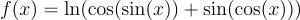
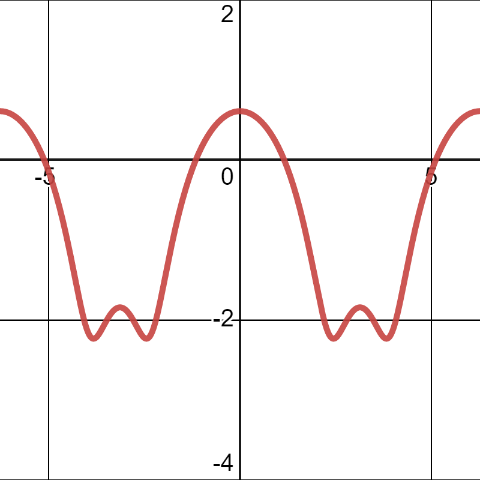

Now we will try to solve a typical use case of evolutionary algorithms: function optimization.
For this example, we will try to find the minimum of the function:



If we plot this function from -2π to 2π, we get the following graph:



Minimizing this function is not trivial, and it is a good example of a problem that can be solved 
using evolutionary algorithms.

# Fitness Function

The fitness function is very simple, it receives an individual and returns the value of the function
for that individual.

```kotlin
private fun fitnessFunction(genotype: Genotype<Double>) = genotype.flatten().first()
    .let {
        ln(cos(sin(it)) + sin(cos(it)))
    }
```

There are two things to notice here:

- The genotype contains a list of chromosomes, and each chromosome contains a list of genes. 
  This makes it difficult to access the value of the gene, so we use the `flatten()` function to
  get a list with only the values (``dna``) of the genes.
- The fitness function is a function of a single variable, so we only need the first gene of the
  flattened genotype.

# Engine setup

The next step is initializing the engine.

For the genotype of the individuals, we will be using a ``DoubleChromosome``, which is a chromosome
that contains genes of type ``Double``, with a minimum value of -2π and a maximum value of 2π.
This can be done as follows:

```kotlin
DoubleChromosome.Builder(size = 1, range = (-2.0 * Math.PI)..(2 * Math.PI))
```

Since we are optimizing a single variable function, we only need one gene in the chromosome (i.e.
``size = 1``).

The engine can then be created as follows:

```kotlin
val engine = engine(::fitnessFunction, genotype {
    chromosomes = listOf(DoubleChromosome.Builder(1, (-2.0 * Math.PI)..(2 * Math.PI)))
}) {
    populationSize = 500
    optimizer = FitnessMinimizer()
    alterers = listOf(Mutator(0.05), MeanCrossover(0.06))
    limits = listOf(SteadyGenerations(20))
    statistics = listOf(StatisticCollector())
}
```

Here:
- We are creating a population of 500 individuals.
- We are using a ``FitnessMinimizer``, which means that the engine will try to minimize the fitness
  function (since we are trying to find the minimum of the function).
- We are using a ``Mutator`` and a ``MeanCrossover`` as the alterers. The ``Mutator`` will mutate
  the genes of the individuals, and the ``MeanCrossover`` will combine the genes of the parents by 
  taking the mean of the genes' values.
- We are using a ``SteadyGenerations`` limit, which means that the engine will stop if the fitness 
  of the best individual in the population does not change for 20 generations.
- We are using a ``StatisticCollector``, which will make a summary of the evolution process.

# Collecting the results

Now we can run the engine and obtain the results:

```kotlin
engine.run()
println(engine.statistics.last())
```

This will output something like this:

```
------------ Statistics Collector -------------
-------------- Selection Times ----------------
|--> Offspring Selection
|   |--> Average: 1.826086956521739 ms
|   |--> Max: 22 ms
|   |--> Min: 0 ms
|--> Survivor Selection
|   |--> Average: 1.6956521739130435 ms
|   |--> Max: 21 ms
|   |--> Min: 0 ms
--------------- Alteration Times --------------
|--> Average: 2.739130434782609 ms
|--> Max: 21 ms
|--> Min: 0 ms
-------------- Evolution Results --------------
|--> Total time: 423 ms
|--> Average generation time: 17.956521739130434 ms
|--> Max generation time: 264 ms
|--> Min generation time: 1 ms
|--> Generation: 23
|--> Steady generations: 20
|--> Fittest: {  [ [-2.443953721458281] ]  -> -2.2336568543940163 }
|--> Best fitness: -2.2336568543940163
```

Let's focus on the ``Fittest`` parameter, which contains the best individual found by the engine.
It is defined as a pair (``-2.443953721458281``, ``-2.2336568543940163``) where the first value is
the genotype of the best individual, and the second value is its fitness.
This means that the solution found is that the minimum of the function is ``-2.2336568543940163`` 
and it is achieved when ``x = -2.443953721458281``.

**[Full code]()**